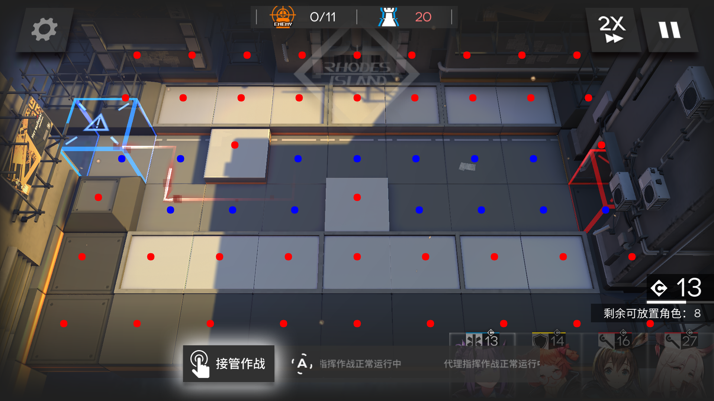

# Arknights-Tile-Pos
识别明日方舟地图中的格子坐标  
--
## 已经支持的内容
- 所有的地图（除非鹰角修改了这部分代码）
- 所有的分辨率 (鹰角支持的，此程序都能支持)
- 包括放置干员时的倾斜视角

## 示例

## 特色
使用矩阵计算而不是图色识别，准确率可达100%  
图色识别是有极限的，我不做图色识别了，jojo(bushi)

## 后记
代码本身没什么好说的，关键是代码背后的东西。
