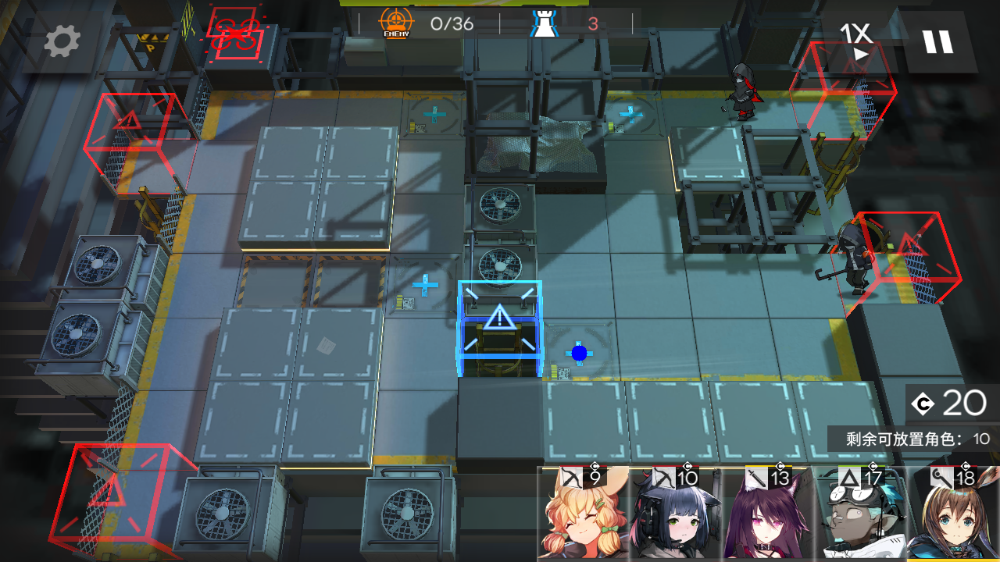
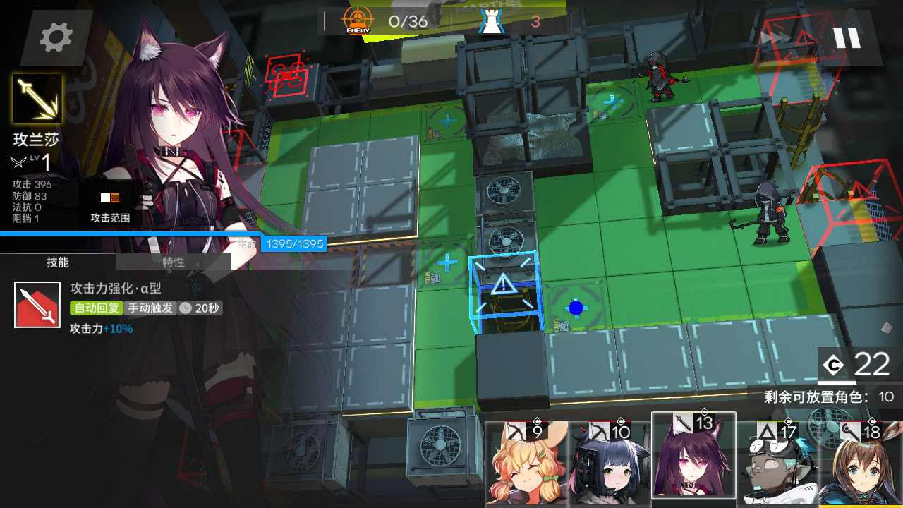
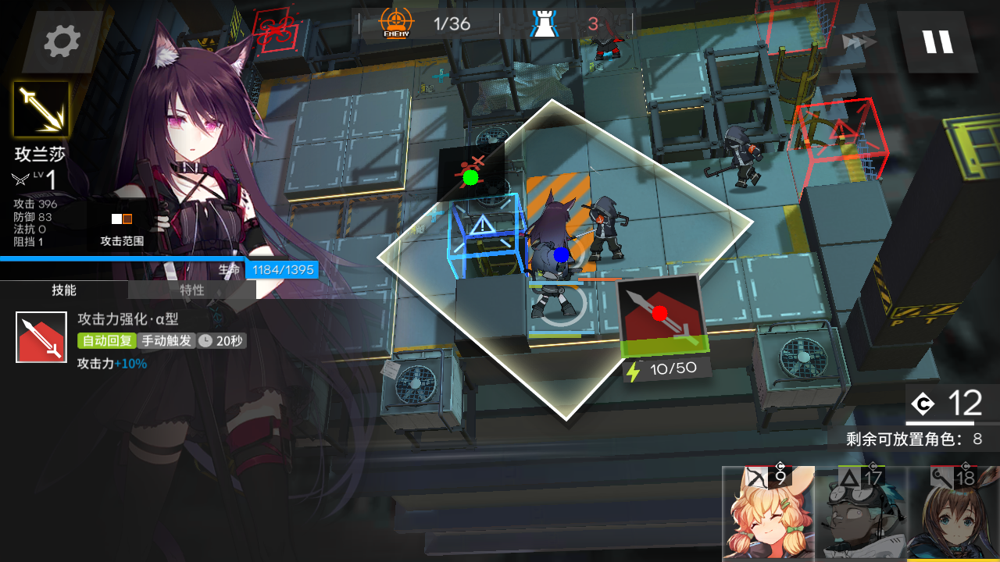

# Arknights-Tile-Pos
识别明日方舟地图中的格子坐标  
--
## 地图数据
[github](https://raw.githubusercontent.com/yuanyan3060/Arknights-Bot-Resource/main/levels.json)
[fastgit](https://raw.fastgit.org/yuanyan3060/Arknights-Bot-Resource/main/levels.json)

## 已经支持的内容
- 所有的地图（除非鹰角修改了这部分代码）
- 所有的分辨率 (鹰角支持的，此程序都能支持)
- 包括放置干员时的倾斜视角 技能按钮 撤退按钮

## 特色
使用矩阵计算而不是图色识别，准确率可达100%  
图色识别是有极限的，我不做图色识别了，jojo(bushi)

## 后记
代码本身没什么好说的，关键是代码背后的东西。  
如果你的产品或项目，直接或间接使用了本仓库中的内容  
请注明出处并包括github url: https://github.com/yuanyan3060/Arknights-Tile-Pos

## 示例
  
  
  
  
